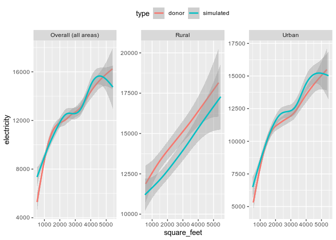
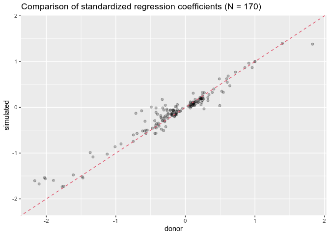

fusionModel
================
Kevin Ummel (<ummel@sas.upenn.edu>)

## Overview

**fusionModel** enables variables unique to a “donor” dataset to be
statistically simulated for (i.e. *fused to*) a “recipient” dataset. The
resulting “fused data” contains all of the recipient *and* donor
variables. The latter are true “synthetic” data – *not* observations
sampled/matched from the donor – and resemble the original donor data in
key respects. fusionModel provides a simple and efficient interface for
general data fusion in *R*. The current release is a beta version.

The package was originally developed to allow statistical integration of
microdata from disparate social surveys. fusionModel is the data fusion
workhorse underpinning the larger fusionACS data platform under
development at the [Socio-Spatial Climate
Collaborative](https://web.sas.upenn.edu/sociospatialclimate/). In this
context, fusionModel is used to fuse variables from a range of social
surveys onto microdata from the American Community Survey, allowing for
analysis and spatial resolution otherwise impossible.

fusionModel can also be used for “pure” data synthesis; i.e. creation of
a wholly synthetic version of a single dataset. This is a specific case
of the more general data fusion problem.

## Methodology

**fusionModel** builds on techniques developed for data synthesis and
statistical disclosure control; e.g. the
[synthpop](https://cran.r-project.org/web/packages/synthpop/index.html)
package ([Nowok, Raab and Dibben
2016](https://doi.org/10.18637%2Fjss.v074.i11)). It uses classification
and regression tree (CART) models ([Breiman et
al. 1984](https://www.routledge.com/Classification-and-Regression-Trees/Breiman-Friedman-Stone-Olshen/p/book/9780412048418);
see [rpart](https://cran.r-project.org/web/packages/rpart/index.html))
to partition donor observations into low-variance nodes. Observations in
a given node are randomly sampled to create simulated values for
recipient observations assigned to the same node, as originally
introduced by [Reiter
(2005)](https://nces.ed.gov/FCSM/pdf/2003FCSM_Reiter.pdf). In the
continuous case, kernel density estimation is used to create a “smooth”
conditional probability distribution for each node. This nonparametric
approach is used to sequentially simulate the fusion variables, allowing
previously-simulated variables to become predictors in subsequent models
(i.e. “chained” models).

The package contains a number of features and innovations designed to
improve performance across intended use cases:

-   Pseudo-optimal ordering of the fusion variables is determined from
    analysis of predictor importance in fully-specified `rpart` models
    fit upfront.

-   LASSO regression is used to “pre-screen” predictor variables prior
    to calling `rpart()`. Predictors for which the LASSO coefficient is
    shrunk to zero are excluded from consideration. This can speed up
    tree-building considerably for larger datasets.

-   A K-means clustering strategy is used to “collapse” the levels of
    unordered factor predictor variables. This allows much faster
    tree-building when categorical variables with many levels are used
    to model unordered factor response variables.

-   Highly-linear or otherwise strictly dependent pairwise relationships
    are automatically detected and preserved in the simulation output.
    Such relationships can be problematic for decision tree simulation
    algorithms.

-   When LASSO pre-screening is enabled, the LASSO results are used to
    determine if a fusion variable should be simulated using a linear
    model rather than a decision tree. This allows highly-linear
    multivariate relationships to be modeled as such explicitly.

-   For continuous and ordered factor data types, the fusion/simulation
    step (optionally) identifies a minimal-change “reshuffling” of
    initial simulated values that induces more realistic rank
    correlations with other variables. *This feature is experimental*.

-   The model-building process is fully parallel on UNIX-like systems.

-   Key parts of the code utilize
    [data.table](https://cran.r-project.org/web/packages/data.table/index.html)
    and
    [biglm](https://cran.r-project.org/web/packages/biglm/index.html)
    functionality for more efficient computation with larger datasets.

-   Fitted `rpart` models are “slimmed” to retain only the information
    absolutely necessary for the data fusion process, leading to reduced
    file size when saved to disk and improved load times.

## Installation

``` r
devtools::install_github("ummel/fusionModel")
library(fusionModel)
```

## Data fusion example

The fusionModel package contains example microdata constructed from the
2015 Residential Energy Consumption Survey (see `?recs` for details and
variable definitions). For real-world use cases, the donor and recipient
input datasets are typically independent and possibly very different in
the number of observations. For illustrative purposes, we will use the
`recs` dataset to create both our “donor” and “recipient” data. This
will also allow us to isolate the performance of fusionModel’s
algorithms.

``` r
# Donor dataset
donor <- recs
dim(donor)
```

    [1] 5686   28

``` r
# Recipient dataset
# Retain a handful of variables we will treat as "predictors" common to both donor and recipient
recipient <- subset(recs, select = c(division, urban_rural, climate, income, age, race))
head(recipient)
```

                division urban_rural                  climate            income age
    1            Pacific       Urban IECC climate zones 3B-4B  $140,000 or more  42
    2 West South Central       Rural IECC climate zones 1A-2A $20,000 - $39,999  60
    3 East South Central       Urban     IECC climate zone 3A $20,000 - $39,999  73
    4 West North Central       Urban     IECC climate zone 4A $40,000 - $59,999  69
    5    Middle Atlantic       Urban     IECC climate zone 5A $40,000 - $59,999  51
    6        New England       Urban IECC climate zones 6A-6B Less than $20,000  33
                                  race
    1                            White
    2                            White
    3                            White
    4 American Indian or Alaska Native
    5                            Asian
    6                            White

The `recipient` dataset contains 6 variables that are shared with
`donor`. These shared “predictor” variables provide a statistical link
between the two datasets. fusionModel exploits the information in these
shared variables.

There are 22 non-shared variables that are unique to `donor`. These are
the variables that will be fused to `recipient`. This includes a mix of
continuous, logical, ordered factor, and unordered factor variables.

``` r
# The variables to be fused
fusion.vars <- setdiff(names(donor), names(recipient))
fusion.vars
```

     [1] "education"      "employment"     "hh_size"        "renter"        
     [5] "home_type"      "year_built"     "square_feet"    "insulation"    
     [9] "heating"        "equipm"         "aircon"         "centralac_age" 
    [13] "televisions"    "disconnect"     "electricity"    "natural_gas"   
    [17] "fuel_oil"       "propane"        "propane_btu"    "propane_expend"
    [21] "use_ng"         "have_ac"       

``` r
# The types of variables to be fused
table(sapply(donor[fusion.vars], vctrs::vec_ptype_abbr))
```


    dbl fct int lgl ord 
      5   5   4   3   5 

We build our fusion model using the `train()` function. The minimal
usage is shown below. See `?train` for additional function arguments and
options. Note that observation weights are ignored here for simplicity
but can be incorporated via the optional `weights` argument.

``` r
fit <- train(data = donor, y = fusion.vars)
```

    22 fusion variables
    6 initial predictor variables
    5686 observations
    Searching for derivative relationships...
    Detected 3 derivative variable(s) that can be omitted from modeling
    Determining order of fusion variables...
    Building fusion models...

The resulting object (`fit`) contains all of the information necessary
to statistically fuse the `fusion.vars` to *any* recipient dataset
containing the necessary shared predictors. Fusion is performed using
the `fuse()` function.

``` r
sim <- fuse(data = recipient, train.object = fit)
```

The output from `fuse()` contains simulated/synthetic values for each of
the `fusion.vars` for each observation in `recipient`. The order of the
columns reflects the order in which the variables were fused. A
pseudo-optimal order is determined automatically within `train()`. Let’s
look at just a few of the simulated variables.

``` r
head(sim[, 1:7])
```

                                          aircon           employment
    1            Central air conditioning system Not employed/retired
    2            Central air conditioning system Not employed/retired
    3 Both a central system and individual units Not employed/retired
    4            Central air conditioning system Not employed/retired
    5            Central air conditioning system   Employed full-time
    6   Individual window/wall or portable units Not employed/retired
                                 heating
    1 Natural gas from underground pipes
    2           Do not use space heating
    3 Natural gas from underground pipes
    4                        Electricity
    5 Natural gas from underground pipes
    6                  Fuel oil/kerosene
                                                                                education
    1                                             Bachelor's degree (for example: BA, BS)
    2                                                          High school diploma or GED
    3                                                          High school diploma or GED
    4                                                  Some college or Associate's degree
    5 Master's, Professional, or Doctorate degree (for example: MA, MS, MBA, MD, JD, PhD)
    6                                                Less than high school diploma or GED
      hh_size   year_built                                    home_type
    1       3 2000 to 2009                 Single-family detached house
    2       1 2000 to 2009                 Single-family detached house
    3       1 2000 to 2009                 Single-family detached house
    4       1 1970 to 1979                 Single-family attached house
    5       3 1980 to 1989                 Single-family detached house
    6       2  Before 1950 Apartment in a building with 5 or more units

**If you run the same code yourself, your results for `sim` *will look
different*.** This is because each call to `fuse()` produces a different
random sampling from the underlying, conditional probability
distributions (see section below on “Generating implicates”).

## Validation

Successful fusion should result in simulated/synthetic variables that
“look like” the donor in key respects. We can perform a series of
comparisons to confirm that this is the case.

The continuous variables in `recs` – like many social survey variables –
can be quite sparse (lots of zeros). Let’s first check that the
proportion of zero values is similar in the donor and simulated data.

              hh_size natural_gas square_feet electricity televisions
    donor           0      0.4193           0           0      0.0239
    simulated       0      0.4193           0           0      0.0241
              propane_expend fuel_oil propane propane_btu
    donor             0.8992   0.9483  0.8992      0.8992
    simulated         0.8996   0.9543  0.8996      0.8996

Comparatively few households use propane or fuel oil, and almost
everyone has a television.

Notice that the proportion of zero values is identical for the “propane”
(gallons consumed), “propane\_btu” (thousand Btu), and “propane\_expend”
(dollars spent) variables. These variables *must* be either all zero or
all non-zero for any given household. Such “structural zeros” are not
uncommon in survey microdata, and they are typically difficult for
tree-based modeling techniques to replicate. fusionModel automatically
detects structural zero patterns and ensures they are correctly
represented in the fusion output.

Now, let’s look at the means of the non-zero values.

              hh_size natural_gas square_feet electricity televisions
    donor      2.5774    576.6752    2081.443    11028.97      2.4195
    simulated  2.6017    589.5476    2112.704    11073.57      2.3975
              propane_expend fuel_oil  propane propane_btu
    donor           672.0280 502.8666 346.7819    31672.67
    simulated       657.8552 489.4481 337.5437    30829.06

Notice that the ratio of mean “propane\_btu” to “propane” is the same
for the donor and simulated datasets (ratio = 91.333). This is as
expected, since the two variables report the same phenomena (propane
consumption) with different units of measurement (gallons vs. Btu). That
is, the relationship is linear. However, decision trees struggle to
capture *strictly* linear relationships. fusionModel automatically
detects highly-linear pairwise relationships and models them explicitly
using linear models rather than decision trees.

Related, fusionModel also detects when one variable is explicitly
“derivative” of another. For example, the “have\_ac” variable can de
deduced entirely from the “aircon” variable. Rather than model
“have\_ac” separately, fusionModel simply merges the known “have\_ac”
outcomes to the simulated “aircon” values. Derivative relationships are
also detected for zero/non-zero outcomes (a tricky case for decision
trees). For example, “natural\_gas” can only be non-zero when “use\_ng”
is TRUE. This dependency is respected in the fusion output.

``` r
# Confirm zero/non-zero relationship is respected for "natural_gas" and "use_ng"
sim %>% select(natural_gas, use_ng) %>% distinct() %>% arrange(natural_gas) %>% head()
```

      natural_gas use_ng
    1    0.000000  FALSE
    2    2.640000   TRUE
    3    3.162125   TRUE
    4    4.326402   TRUE
    5    6.998909   TRUE
    6    9.747504   TRUE

Next, let’s look at kernel density plots of the non-zero values for the
continuous variables where this kind of visualization makes sense.
Recall that “propane” and “fuel\_oil” are quite sparse, which generally
results in noisier simulation.

<!-- -->

For the remaining fused variables, we can compare the relative frequency
(proportion) of different outcomes in the donor and simulated data. Here
is one such comparison for the “insulation” variable.

              Not insulated Poorly insulated Adequately insulated Well insulated
    donor            0.0135           0.1583               0.4829         0.3452
    simulated        0.0137           0.1597               0.4893         0.3373

This kind of comparison can be extended to all of the fusion variables
and summarized in a single plot.

<!-- -->

So far, we’ve only looked at univariate distributions. The much trickier
task in data synthesis is to replicate *interactions* between variables
(e.g. bivariate relationships). For continuous and ordered factor data
types, we can calculate the correlation for each variable pairing
(e.g. the correlation between “income” and “electricity”) and compare
the value calculated for the donor and simulated data. The following
plot shows just that, including pairwise correlations between fused
variables and *predictor* variables.

<!-- -->

The same kind of bivariate comparisons can be made for discrete
variables by looking at the relative frequency of the cells in all
possible 2-way contingency tables. And *voila*:

<!-- -->

Extending to 3-way contingency tables, things get a little bit noisier.

<!-- -->

Bivariate relationships between continuous and categorical variables can
be assessed by plotting the distribution of the former for each level of
the latter – for example, with a boxplot. The plot below shows how
electricity consumption varies with a household’s air conditioning
technology for both the donor and simulated data.

<!-- -->

We can generalize this kind of comparison by calculating “level-wise
means” for the donor and simulated data (again, including predictor
*and* fused variables). Since continuous variables are measured on
widely-varying scales, they are scaled to mean zero and unit variance
for the purposes of comparison.

<!-- -->

Next, for illustrative purposes, we assess the non-linear relationship
between two continuous variables – “square\_feet” and “electricity” –
both overall and for rural and urban areas defined by the “urban\_rural”
variable. The plot below shows the GAM-smoothed relationship for the
donor and simulated data. Note the high degree of overlap for the
confidence interval shading, implying that the relationships are
statistically indistinguishable.

<!-- -->

Finally, we can conduct a more extensive multivariate test by comparing
regression coefficients from models fit to the donor with analogous
coefficients derived from the simulated data. That is, do the results of
a regression analysis using the donor data look similar to results
produced by the simulated data? This is a rather stiff test of
simulation quality, since the simulated data must replicate multivariate
relationships across a range of phenomena.

Each continuous or ordered factor variable is entered as the dependent
variable in an OLS model. A subset of all the other variables (up to
seven total) is selected via LASSO regression to serve as the
predictors. The same model is then fit to both the donor and simulated
data and the coefficients compared. To make the coefficients comparable
across models, all variables are scaled to zero-mean and unit-variance
(i.e. standardized coefficients).

<!-- -->

This exercise yields a total of 170 model terms (including intercepts)
for which coefficients can be compared. The plot above shows that models
fit to the simulated data do a good job replicating coefficients derived
from the original data (correlation = 0.97).

## Generating implicates

Because values are randomly sampled from the conditional probability
distributions, each call to `fuse()` produces a unique, synthetic
dataset referred to as an “implicate” (in the sense of “simple
synthesis”). It is common in data synthesis and imputation to produce
multiple implicates that, collectively, quantify (some of) the
uncertainty inherent in the underlying data.

Since variables are synthesized serially, the creation of multiple
implicates requires running `fuse()` multiple times. For example:

``` r
# Desired number of implicates
n.imp <- 10

# Generate 'n.imp' implicates
sim <- lapply(1:n.imp, function(i) fuse(data = recipient, train.object = fit))
```

We can then look at the variation of a given outcome – e.g. the
correlation between two variables – across the implicates. This provides
an estimate of the variance associated with the outcome.

``` r
# Correlation between electricity consumption and number of televisions, across the implicates
sapply(sim, function(x) cor(x[c("electricity", "televisions")])[1, 2])
```

     [1] 0.3093227 0.3212223 0.3176410 0.3089330 0.3022301 0.3267609 0.3126228
     [8] 0.3064828 0.3473511 0.2977401

## Data synthesis

To generate a wholly synthetic version of `recs`, we proceed as above
but use only a single predictor variable. That predictor is then
manually sampled to “seed” the recipient dataset for fusion.

``` r
# Create fusion model with a single predictor ("division" in this case)
recipient <- subset(recs, select = division)
fusion.vars <- setdiff(names(recs), names(recipient))
fit <- train(data = recs, y = fusion.vars)

# Randomly sample "division" in the recipient and then run fuse()
recipient$division <- sample(recipient$division, size = nrow(recipient))
sim <- fuse(data = recipient, train.object = fit)
```

## Reducing computation time

The `train()` function has a number of optional arguments that can be
used to speed up the model building process. One option is to throw
additional computing resources at the problem via parallel processing
using the `cores` argument. This is only enabled for UNIX-like systems
(i.e. will operate serially on Windows).

``` r
# Function to return computation time
timeMe <- function(...) system.time(capture.output(...))["elapsed"]

# cores = 1
train(data = donor, y = fusion.vars, cores = 1) %>% timeMe()
```

    elapsed 
      6.452 

``` r
# cores = 3
train(data = donor, y = fusion.vars, cores = 3) %>% timeMe()
```

    elapsed 
      3.693 

Binary split decision trees are usually fast, but they can be
*painfully* slow when there are unordered factor response (fusion)
variables in the presence of unordered factor predictors. This situation
requires complete enumeration of the potential split strategies, which
can be very slow if the predictor has many levels. The `maxcats`
argument allows `train` to cluster predictor variable categories in such
cases (up to `maxcats` clusters), thereby reducing the number of splits
that need to be assessed. There is some loss of accuracy in exchange for
(potentially) faster computation. This is most noticeable if you have an
unordered factor with many (e.g. &gt; 15) levels.

``` r
# Make the 'climate' variable a problematic unordered factor with 20 levels
donor$climate <- factor(sample(LETTERS[1:20], nrow(donor), replace = TRUE))

# maxcats = NULL
# Note that train() issues a warning about long compute time
train(data = donor, y = fusion.vars, cores = 3, maxcats = NULL) %>% timeMe()
```

    Warning in train(data = donor, y = fusion.vars, cores = 3, maxcats = NULL): 
    Be careful: Unordered factors are present that could cause long compute times.
    See 'maxcats' argument in ?train.

    elapsed 
     10.504 

``` r
# maxcats = 10
train(data = donor, y = fusion.vars, cores = 3, maxcats = 10) %>% timeMe()
```

    elapsed 
      5.786 

The `lasso` argument directs `train()` to use LASSO regression via
[glmnet](https://cran.r-project.org/web/packages/glmnet/index.html) to
quickly eliminate potential predictor variables prior to tree building.
The idea here is that a predictor whose coefficient is shrunk to zero in
the LASSO model is unlikely to be highly influential in the tree and can
be discarded without significant loss of overall model skill. See
`?train` for more details. As with `maxcats`, there is some (unknown)
loss of accuracy in exchange for faster computation. This is most
helpful for larger datasets, especially when some of the variables are
highly correlated.

``` r
# Make 'donor' larger (more rows and columns)
donor <- recs[sample.int(nrow(recs), 50e3, replace = TRUE), ]
donor[LETTERS] <- runif(26 * nrow(donor))
dim(donor)
```

    [1] 50000    54

``` r
# lasso = NULL
train(data = donor, y = fusion.vars, cores = 3, lasso = NULL) %>% timeMe()
```

    elapsed 
     36.935 

``` r
# lasso = 0.9
train(data = donor, y = fusion.vars, cores = 3, lasso = 0.9) %>% timeMe()
```

    elapsed 
     29.091 

### Happy fusing!
