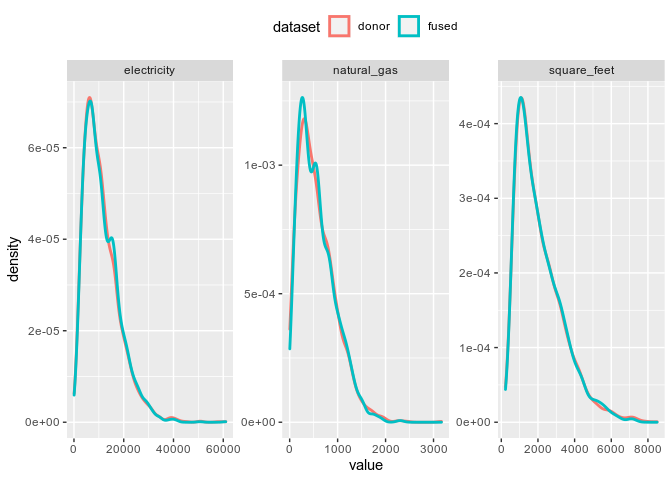
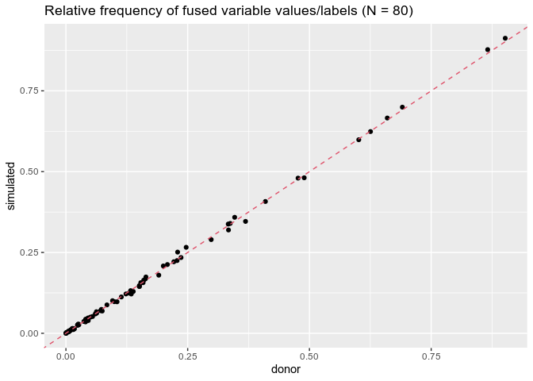
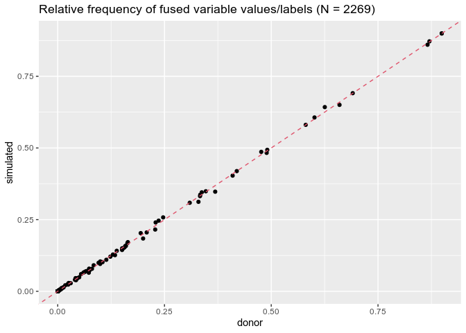
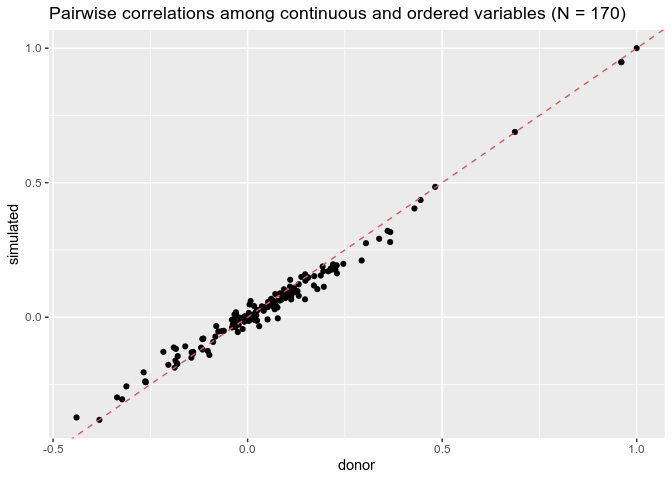
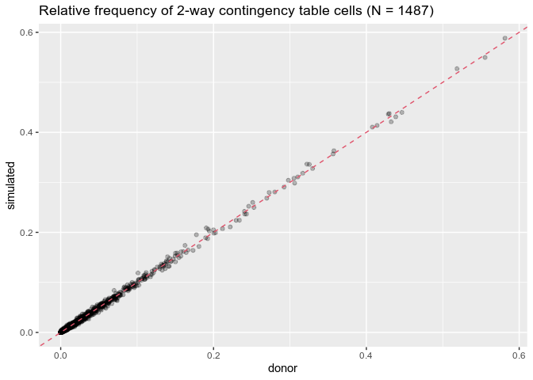
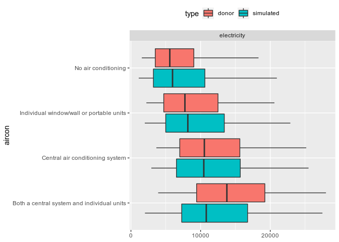
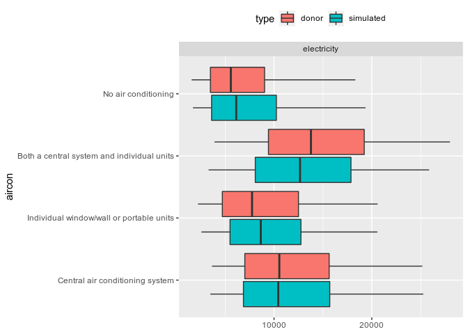
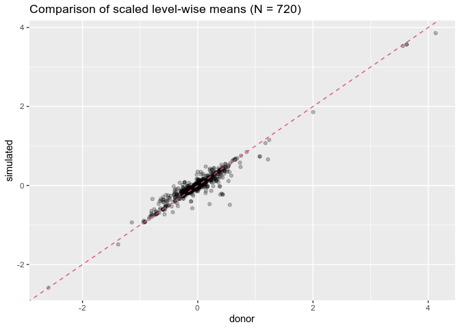

fusionModel
================
Kevin Ummel (<ummel@sas.upenn.edu>)

## Overview

**fusionModel** enables variables unique to a “donor” dataset to be
statistically simulated for (i.e. *fused to*) a “recipient” dataset. The
resulting “fused data” contains all of the recipient *and* donor
variables. The latter are true “synthetic” data – *not* observations
sampled/matched from the donor – and resemble the original donor data in
key respects. fusionModel provides a simple and efficient interface for
general data fusion in *R*. The current release is a beta version.

The package was originally developed to allow statistical integration of
microdata from disparate social surveys. fusionModel is the data fusion
workhorse underpinning the larger fusionACS data platform under
development at the [Socio-Spatial Climate
Collaborative](https://web.sas.upenn.edu/sociospatialclimate/). In this
context, fusionModel is used to fuse variables from a range of social
surveys onto microdata from the American Community Survey, allowing for
analysis and spatial resolution otherwise impossible.

fusionModel can also be used for “pure” data synthesis; i.e. creation of
a wholly synthetic version of a single dataset. This is a specific case
of the more general data fusion problem.

## Methodology

**fusionModel** builds on techniques developed for data synthesis and
statistical disclosure control; e.g. the
[synthpop](https://cran.r-project.org/web/packages/synthpop/index.html)
package ([Nowok, Raab and Dibben
2016](https://doi.org/10.18637%2Fjss.v074.i11)). It uses classification
and regression tree (CART) models ([Breiman et
al. 1984](https://www.routledge.com/Classification-and-Regression-Trees/Breiman-Friedman-Stone-Olshen/p/book/9780412048418);
see [rpart](https://cran.r-project.org/web/packages/rpart/index.html))
to partition donor observations into low-variance nodes. Observations in
a given node are randomly sampled to create simulated values for
recipient observations assigned to the same node, as originally
introduced by [Reiter
(2005)](https://nces.ed.gov/FCSM/pdf/2003FCSM_Reiter.pdf). In the
continuous case, kernel density estimation is used to create a “smooth”
conditional probability distribution for each node. This nonparametric
approach is used to sequentially simulate the fusion variables, allowing
previously-simulated variables to become predictors in subsequent models
(i.e. “chained” models).

The package contains a number of features and innovations designed to
improve performance across intended use cases:

-   Pseudo-optimal ordering of the fusion variables is determined from
    analysis of predictor importance in fully-specified `rpart` models
    fit upfront.

-   For continuous and ordered factor data types, the fusion/simulation
    step (optionally) identifies a minimal-change “reshuffling” of
    initial simulated values that induces more realistic rank
    correlations with other variables. This feature is experimental;
    initial testing suggests it can improve simulation quality.

-   LASSO regression is (optionally) used to “pre-screen” predictor
    variables prior to calling `rpart()`. Predictors for which the LASSO
    coefficient is shrunk to zero are excluded from consideration. This
    can speed up tree-building considerably for larger datasets.

-   A K-means clustering strategy is (optionally) used to “collapse” the
    levels of unordered factor predictor variables. This allows much
    faster tree-building when categorical variables with many levels are
    used to model unordered factor response variables.

-   The model-building process is (optionally) fully parallel on
    UNIX-like systems.

-   Key parts of the code utilize
    [data.table](https://cran.r-project.org/web/packages/data.table/index.html)
    and (optionally)
    [biglm](https://cran.r-project.org/web/packages/biglm/index.html)
    functionality for more efficient computation with larger datasets.

-   Fitted `rpart` models are “slimmed” to retain only the information
    absolutely necessary for the data fusion process, leading to reduced
    file size when saved to disk and improved load times.

## Installation

``` r
devtools::install_github("ummel/fusionModel")
library(fusionModel)
```

## Data fusion example

The fusionModel package contains sample microdata with a mix of data
types constructed from the 2015 Residential Energy Consumption Survey
(see `?recs` for details and variable definitions). For real-world use
cases, the donor and recipient input datasets are typically independent
and possibly very different in the number of observations. For
illustrative purposes, we will use the `recs` dataset to create both our
“donor” and “recipient” data. This will also allow us to isolate the
performance of fusionModel’s algorithms.

``` r
# Donor dataset
donor <- recs
dim(donor)
```

    [1] 5686   24

``` r
# Recipient dataset
# Retain a handful of variables we will treat as "predictors" common to both donor and recipient
recipient <- subset(recs, select = c(division, urban_rural, climate, income, age, race))
head(recipient)
```

                division   urban_rural                  climate            income
    1            Pacific    Urban Area IECC climate zones 3B-4B  $140,000 or more
    2 West South Central         Rural IECC climate zones 1A-2A $20,000 - $39,999
    3 East South Central    Urban Area     IECC climate zone 3A $20,000 - $39,999
    4 West North Central Urban Cluster     IECC climate zone 4A $40,000 - $59,999
    5    Middle Atlantic    Urban Area     IECC climate zone 5A $40,000 - $59,999
    6        New England Urban Cluster IECC climate zones 6A-6B Less than $20,000
      age                             race
    1  42                            White
    2  60                            White
    3  73                            White
    4  69 American Indian or Alaska Native
    5  51                            Asian
    6  33                            White

The `recipient` dataset contains 6 variables that are shared with
`donor`. These shared “predictor” variables provide a statistical link
between the two datasets. fusionModel exploits the information in these
shared variables.

There are 18 non-shared variables that are unique to `donor`. These are
the variables that will be fused to `recipient`. This includes a mix of
continuous, ordered factor, and unordered factor variables.

``` r
# The variables to be fused
fusion.vars <- setdiff(names(donor), names(recipient))
fusion.vars
```

     [1] "education"        "employment"       "tenure"           "hh_size"         
     [5] "home_type"        "year_built"       "square_feet"      "insulation"      
     [9] "televisions"      "refrigerator_age" "heating"          "aircon"          
    [13] "disconnect"       "unhealthy"        "electricity"      "natural_gas"     
    [17] "propane"          "fuel_oil"        

We build our fusion model using the `train()` function. The minimal
usage is shown below. See `?train` for additional function arguments and
options. Note that observation weights are ignored here for simplicity
but can be incorporated via the optional `weights` argument.

``` r
fit <- train(data = donor, y = fusion.vars)
```

The resulting object (`fit`) contains all of the information necessary
to statistically fuse the `fusion.vars` to *any* recipient dataset
containing the necessary shared predictors. Fusion is performed using
the `fuse()` function.

``` r
sim <- fuse(data = recipient, train.object = fit)
```

The output from `fuse()` contains simulated/synthetic values for each of
the `fusion.vars` for each observation in `recipient`. The order of the
columns reflects the order in which the variables were fused. A
pseudo-optimal order is determined automatically within `train()`. Let’s
look at just a few of the simulated variables.

``` r
head(sim[, 1:7])
```

                employment  propane
    1   Employed full-time  0.00000
    2 Not employed/retired  0.00000
    3 Not employed/retired  0.00000
    4 Not employed/retired  0.00000
    5   Employed full-time  0.00000
    6   Employed full-time 87.60114
                                                                                education
    1                                             Bachelor’s degree (for example: BA, BS)
    2                                                          High school diploma or GED
    3                                                          High school diploma or GED
    4                                                          High school diploma or GED
    5 Master’s, Professional, or Doctorate degree (for example: MA, MS, MBA, MD, JD, PhD)
    6                                                          High school diploma or GED
                                                                          heating
    1                                                             Central furnace
    2                                                   Portable electric heaters
    3                                                             Central furnace
    4                                                             Central furnace
    5                              Steam/hot water system with radiators or pipes
    6 Built-in electric units installed in walls, ceilings, baseboards, or floors
      fuel_oil hh_size   refrigerator_age
    1        0       2   2 to 4 years old
    2        0       1   2 to 4 years old
    3        0       3 15 to 19 years old
    4        0       3   2 to 4 years old
    5        0       1   5 to 9 years old
    6    72060       1   2 to 4 years old

**If you run the same code yourself, your results for `sim` *will look
different*.** This is because each call to `fuse()` produces a different
random sampling from the underlying, conditional probability
distributions (see section below on “Generating implicates”).

## Validation

Successful fusion should result in simulated/synthetic variables that
“look like” the donor in key respects. We can run a series of simple
comparisons to confirm that this is the case. The continuous variables
in `recs` – like many social survey variables – can be very sparse (lots
of zeros). Let’s first check that the proportion of zero values is
similar in the donor and simulated data.

              propane fuel_oil hh_size square_feet electricity natural_gas
    donor      0.8992   0.9483       0           0           0      0.4193
    simulated  0.8943   0.9499       0           0           0      0.4277
              televisions
    donor          0.0239
    simulated      0.0251

Comparatively few households use propane or fuel oil, and almost
everyone has a television. Now let’s look at the means of the non-zero
values.

               propane fuel_oil hh_size square_feet electricity natural_gas
    donor     346.7819 69028.60  2.5774    2081.443    11028.97    576.6752
    simulated 359.3702 72624.41  2.5601    2078.941    11033.72    574.7071
              televisions
    donor          2.4195
    simulated      2.4023

Next, let’s look at kernel density plots of the non-zero values for the
continuous variables where this kind of visualization makes sense.
Recall that “propane” and “fuel\_oil” are quite sparse, which generally
results in noisier simulation.

<!-- -->

For the remaining fused variables, we can compare the relative frequency
(proportion) of different outcomes in the donor and simulated data. Here
is one such comparison for the “insulation” variable.

              Not insulated Poorly insulated Adequately insulated Well insulated
    donor            0.0151           0.1641               0.4810         0.3398
    simulated        0.0137           0.1597               0.4893         0.3373

This kind of comparison can be extended to all of the fusion variables
and summarized in a single plot.

<!-- -->

So far, we’ve only looked at univariate distributions. The much trickier
task in data synthesis is to replicate *interactions* between variables
(e.g. bivariate relationships). For continuous and ordered factor data
types, we can calculate the correlation for each variable pairing
(e.g. the correlation between “income” and “electricity”) and compare
the value calculated for the donor and simulated data. The following
plot shows just that, including pairwise correlations between fused
variables and *predictor* variables.

<!-- -->

The same kind of bivariate comparisons can be made for discrete
variables by looking at the relative frequency of the cells in all
possible 2-way contingency tables. And *voila*:

<!-- -->

Extending to 3-way contingency tables, things get a bit noisier.

<!-- -->

Bivariate relationships between continuous and categorical variables can
be assessed by plotting the distribution of the former for each level of
the latter – for example, with a boxplot. The plot below shows how
electricity consumption varies with a household’s air conditioning
technology for both the donor and simulated data.

<!-- -->

We can generalize this kind of comparison by calculating “level-wise
means” for the donor and simulated data (again, including predictor
*and* fused variables). Since continuous variables are measured on
widely-varying scales, they are scaled to mean zero and unit variance
for the purposes of comparison.

<!-- -->

Finally, for illustrative purposes, we assess the non-linear
relationship between two continuous variables – “square\_feet” and
“electricity” – both overall and for geographic areas defined by the
“urban\_rural” variable. The plot below shows the GAM-smoothed
relationship for the donor and simulated data. Note the high degree of
overlap for the confidence interval shading, implying that the
relationships are statistically indistinguishable.

<!-- -->

## Generating implicates

Because values are randomly sampled from the conditional probability
distributions, each call to `fuse()` produces a unique, synthetic
dataset referred to as an “implicate” (in the sense of “simple
synthesis”). It is common in data synthesis and imputation to produce
multiple implicates that, collectively, quantify (some of) the
uncertainty inherent in the underlying data.

Since variables are synthesized serially, the creation of multiple
implicates requires running `fuse()` multiple times. For example:

``` r
# Desired number of implicates
n.imp <- 10

# Generate 'n.imp' implicates
sim <- lapply(1:n.imp, function(i) fuse(data = recipient, train.object = fit))
```

We can then look at the variation of a given outcome – e.g. the
correlation between two variables – across the implicates. This provides
an estimate of the variance associated with the outcome.

``` r
# Correlation between electricity consumption and number of televisions, across the implicates
sapply(sim, function(x) cor(x[c("electricity", "televisions")])[1, 2])
```

     [1] 0.3611359 0.3594623 0.3609690 0.3432436 0.3519176 0.3535760 0.3381441
     [8] 0.3545926 0.3641155 0.3635590

## Data synthesis

To generate a wholly synthetic version of `recs`, we proceed as above
but use only a single predictor variable. That predictor is then
manually sampled to “seed” the recipient dataset.

``` r
# Create fusion model with a single predictor ("division" in this case)
recipient <- subset(recs, select = division)
fusion.vars <- setdiff(names(recs), names(recipient))
fit <- train(data = recs, y = fusion.vars)

# Randomly sample "division" in the recipient and then run fuse()
recipient$division <- sample(recipient$division, size = nrow(recipient))
sim <- fuse(data = recipient, train.object = fit)
```

## Reducing computation time

The `train()` function has a number of optional arguments that can be
used to speed up the model building process. One option is to throw
additional computing resources at the problem via parallel processing
using the `mc` (“multicore”) argument. As of v0.2, this is only enabled
for UNIX-like systems (i.e. it fails on Windows). Note that
`train(..., mc = TRUE)` will utilize all of the available cores except
one.

``` r
# Function to return computation time
timeMe <- function(...) system.time(capture.output(...))["elapsed"]

# Without parallel processing (default; 'mc = FALSE')
timeMe(train(data = donor, y = fusion.vars, mc = FALSE))
```

    elapsed 
      7.562 

``` r
# With parallel processing ('mc = TRUE')
timeMe(train(data = donor, y = fusion.vars, mc = TRUE))
```

    elapsed 
      4.043 

Binary split decision trees are usually fast, but they can be
*painfully* slow when there are unordered factor response (fusion)
variables in the presence of unordered factor predictors. This situation
requires complete enumeration of the potential split strategies, which
can be very slow if the predictor has many levels. The `maxcats`
argument allows `train` to cluster predictor variable categories in such
cases (up to `maxcats` clusters), thereby reducing the number of splits
that need to be assessed. There is some loss of accuracy in exchange for
(potentially) faster computation. This is most noticeable if you have an
unordered factor with many (e.g. &gt; 15) levels.

``` r
# Make the 'climate' variable a problematic unordered factor with 20 levels
donor$climate <- factor(sample(LETTERS[1:20], nrow(donor), replace = TRUE))

# Default approach ('maxcats = NULL')
# Note that train() issues a warning about long compute time
timeMe(train(data = donor, y = fusion.vars, mc = TRUE, maxcats = NULL))
```

    Warning in train(data = donor, y = fusion.vars, mc = TRUE, maxcats = NULL): 
    Be careful: Unordered factors are present that could cause long compute times.
    See 'maxcats' argument in ?train.

    elapsed 
     15.417 

``` r
# Using `maxcats = 10`
timeMe(train(data = donor, y = fusion.vars, mc = TRUE, maxcats = 10))
```

    elapsed 
      8.328 

The `lasso` argument directs `train()` to use LASSO regression via
[glmnet](https://cran.r-project.org/web/packages/glmnet/index.html) to
quickly eliminate potential predictor variables prior to tree building.
The idea here is that a predictor whose coefficient is shrunk to zero in
the LASSO model is unlikely to be highly influential in the tree and can
be discarded without significant loss of overall model skill. See
`?train` for more details. As with `maxcats`, there is some (unknown)
loss of accuracy in exchange for faster computation. This is most
helpful for larger datasets, especially when some of the variables are
highly correlated.

``` r
# Make 'donor' larger (more rows and columns)
donor <- recs[sample.int(nrow(recs), 50e3, replace = TRUE), ]
donor[LETTERS] <- runif(26 * nrow(donor))
dim(donor)
```

    [1] 50000    50

``` r
# Default approach (`lasso = NULL`)
timeMe(train(data = donor, y = fusion.vars, mc = TRUE))
```

    elapsed 
     42.593 

``` r
# Using `lasso = 0.9`
timeMe(train(data = donor, y = fusion.vars, mc = TRUE, lasso = 0.9))
```

    elapsed 
     27.746 

### Happy fusing!
