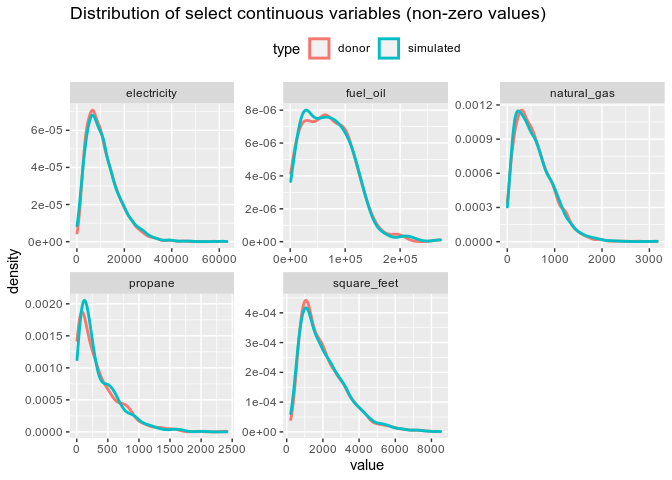
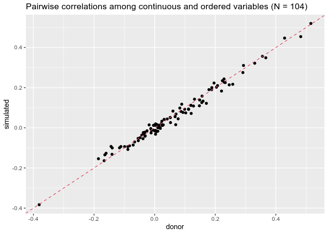
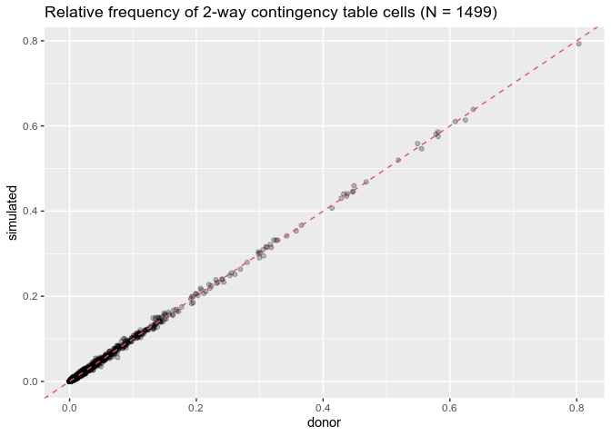
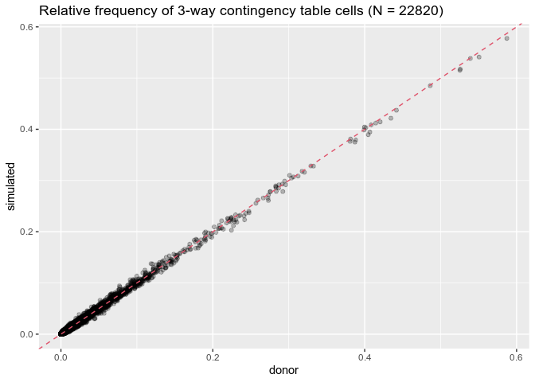
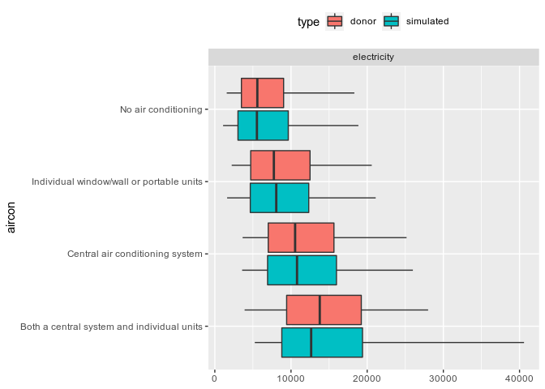
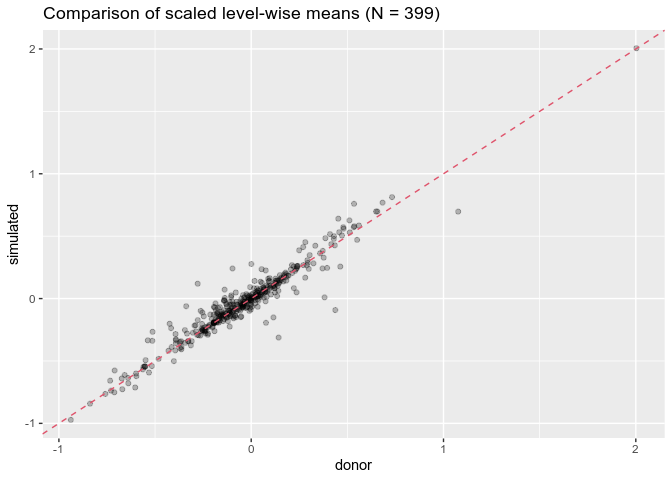
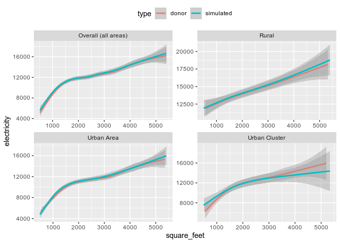

## Overview

**fusionModel** enables variables unique to a “donor” dataset to be
statistically simulated for (i.e. *fused to*) a “recipient” dataset. The
resulting “fused data” contains all of the recipient *and* donor
variables. The latter are true “synthetic” data – *not* observations
sampled/matched from the donor – and resemble the original donor data in
key respects. fusionModel provides a simple and efficient interface for
general data fusion in *R*. The current release is a beta version.

The package was originally developed to allow statistical integration of
microdata from disparate social surveys. fusionModel is the data fusion
workhorse underpinning the larger fusionACS data platform under
development at the [Socio-Spatial Climate
Collaborative](https://web.sas.upenn.edu/sociospatialclimate/). In this
context, fusionModel is used to fuse variables from a range of social
surveys onto microdata from the American Community Survey, allowing for
analysis and spatial resolution otherwise impossible.

fusionModel can also be used for “pure” data synthesis; i.e. creation of
a wholly synthetic version of a single dataset. This is a specific case
of the more general data fusion problem.

## Methodology

**fusionModel** builds on techniques developed for data synthesis and
statistical disclosure control; e.g. the
[synthpop](https://cran.r-project.org/web/packages/synthpop/index.html)
package ([Nowok, Raab and Dibben
2016](https://doi.org/10.18637%2Fjss.v074.i11)). It uses classification
and regression tree models ([Breiman et
al. 1984](https://www.routledge.com/Classification-and-Regression-Trees/Breiman-Friedman-Stone-Olshen/p/book/9780412048418);
see [rpart](https://cran.r-project.org/web/packages/rpart/index.html))
to partition donor observations into low-variance nodes. Observations in
a given node are randomly sampled to create simulated values for
recipient observations assigned to the same node, as originally
introduced by [Reiter
(2005)](https://nces.ed.gov/FCSM/pdf/2003FCSM_Reiter.pdf). In the
continuous case, kernel density estimation is used to create a “smooth”
conditional probability distribution for each node. This nonparametric
approach is used to sequentially simulate the fusion variables, allowing
previously-simulated variables to become predictors in subsequent models
(i.e. “chained” models).

The package contains a number of innovations to improve performance
across intended use cases:

-   Pseudo-optimal ordering of the fusion variables is determined from
    analysis of predictor importance in fully-specified CART models fit
    upfront. This step leverages parallel processing, and the results
    can also be used to exclude predictors from (and, therefore, speed
    up) subsequent sequential model-fitting for large datasets.

-   For continuous and ordered factor data types, the fusion/simulation
    step identifies a minimal-change “reshuffling” of initial simulated
    values that induces more realistic rank correlations with other
    variables. Initial testing suggests this technique can improve
    simulation quality.

-   A K-means clustering strategy is used to allow faster tree-building
    in the presence of factor variables with many levels.

-   Fitted CART models are “slimmed” to retain only the information
    absolutely necessary for the data fusion process, thereby reducing
    the size of saved-on-disk objects and improving load times.

## Installation

``` r
devtools::install_github("ummel/fusionModel")
library(fusionModel)
```

## Data fusion example

The fusionModel package contains sample microdata with a mix of data
types constructed from the 2015 Residential Energy Consumption Survey
(see `?recs` for details and variable definitions). For real-world use
cases, the donor and recipient input datasets are typically independent
and possibly very different in the number of observations. For
illustrative purposes, we will use the `recs` dataset to create both our
“donor” and “recipient” data. This will also allow us to isolate the
performance of fusionModel’s algorithms.

``` r
# Donor dataset
donor <- recs
dim(donor)
```

    [1] 5686   24

``` r
# Recipient dataset
# Retain a handful of variables we will treat as "predictors" common to both donor and recipient
recipient <- subset(recs, select = c(division, urban_rural, climate, income, age, race))
head(recipient)
```

                division   urban_rural                  climate            income
    1            Pacific    Urban Area IECC climate zones 3B-4B  $140,000 or more
    2 West South Central         Rural IECC climate zones 1A-2A $20,000 - $39,999
    3 East South Central    Urban Area     IECC climate zone 3A $20,000 - $39,999
    4 West North Central Urban Cluster     IECC climate zone 4A $40,000 - $59,999
    5    Middle Atlantic    Urban Area     IECC climate zone 5A $40,000 - $59,999
    6        New England Urban Cluster IECC climate zones 6A-6B Less than $20,000
      age                             race
    1  42                            White
    2  60                            White
    3  73                            White
    4  69 American Indian or Alaska Native
    5  51                            Asian
    6  33                            White

The `recipient` dataset contains 6 variables that are shared with
`donor`. These shared “predictor” variables provide a statistical link
between the two datasets. fusionModel exploits the information in these
shared variables.

There are 18 non-shared variables that are unique to `donor`. These are
the variables that will be fused to `recipient`. This includes a mix of
continuous, ordered factor, and unordered factor variables.

``` r
# The variables to be fused
fusion.vars <- setdiff(names(donor), names(recipient))
fusion.vars
```

     [1] "education"        "employment"       "tenure"           "hh_size"         
     [5] "home_type"        "year_built"       "square_feet"      "insulation"      
     [9] "televisions"      "refrigerator_age" "heating"          "aircon"          
    [13] "disconnect"       "unhealthy"        "electricity"      "natural_gas"     
    [17] "propane"          "fuel_oil"        

We build our fusion model using the `train()` function. The minimal
usage is shown below. See `?train` for additional function arguments and
options. Note that observation weights are ignored here for simplicity
but can be incorporated via the optional `weights` argument.

``` r
fit <- train(data = donor, y = fusion.vars)
```

The resulting object (`fit`) contains all of the information necessary
to statistically fuse the `fusion.vars` to *any* recipient dataset
containing the necessary shared predictors. Fusion is performed using
the `fuse()` function.

``` r
sim <- fuse(data = recipient, train.object = fit)
```

The output from `fuse()` contains simulated/synthetic values for each of
the `fusion.vars` for each observation in `recipient`. The order of the
columns reflects the order in which the variables were fused. A
pseudo-optimal order is determined automatically within `train()`. Let’s
look at just a few of the simulated variables.

``` r
head(sim[, 1:7])
```

                employment                                   aircon propane
    1   Employed part-time          Central air conditioning system       0
    2 Not employed/retired Individual window/wall or portable units       0
    3 Not employed/retired Individual window/wall or portable units       0
    4 Not employed/retired          Central air conditioning system       0
    5   Employed full-time          Central air conditioning system       0
    6 Not employed/retired Individual window/wall or portable units       0
                                    education   year_built refrigerator_age
    1 Bachelor’s degree (for example: BA, BS) 1980 to 1989 2 to 4 years old
    2      Some college or Associate’s degree 1980 to 1989 2 to 4 years old
    3              High school diploma or GED 1970 to 1979 5 to 9 years old
    4      Some college or Associate’s degree  Before 1950 2 to 4 years old
    5              High school diploma or GED 1950 to 1959 5 to 9 years old
    6      Some college or Associate’s degree 1950 to 1959 2 to 4 years old
      fuel_oil
    1        0
    2        0
    3        0
    4        0
    5    18967
    6    85792

**If you run the same code yourself, your results for `sim` *will look
different*.** This is because each call to `fuse()` produces a different
random sampling from the underlying, conditional probability
distributions (see section below on “Generating implicates”).

## Validation

Successful fusion should result in simulated/synthetic variables that
“look like” the donor in key respects. We can run a series of simple
comparisons to confirm that this is the case. The continuous variables
in `recs` – like many social survey variables – can be very sparse (lots
of zeros). Let’s first check that the proportion of zero values is
similar in the donor and simulated data.

              propane fuel_oil hh_size electricity square_feet natural_gas
    donor      0.8992   0.9483       0           0           0      0.4193
    simulated  0.8975   0.9476       0           0           0      0.4094
              televisions
    donor          0.0239
    simulated      0.0236

Comparatively few households use propane or fuel oil, and almost
everyone has a television. Now let’s look at the means of the non-zero
values.

               propane fuel_oil hh_size electricity square_feet natural_gas
    donor     346.7819 69028.60  2.5774    11028.97    2081.443    576.6752
    simulated 354.4844 69416.08  2.5675    11166.61    2088.699    578.6748
              televisions
    donor          2.4195
    simulated      2.4242

Next, let’s look at kernel density plots of the non-zero values for the
continuous variables where this kind of visualization makes sense.
Recall that “propane” and “fuel\_oil” are quite sparse, which generally
results in noisier results.

<!-- -->

For the remaining fused variables, we can compare the relative frequency
(proportion) of different outcomes in the donor and simulated data. Here
is one such comparison for the “insulation” variable.

              Not insulated Poorly insulated Adequately insulated Well insulated
    donor            0.0120           0.1527               0.4977         0.3377
    simulated        0.0137           0.1597               0.4893         0.3373

This kind of comparison can be extended to all of the fusion variables
and summarized in a single plot.

<!-- -->

So far, we’ve only looked at univariate distributions. The much trickier
task in data synthesis is to replicate *interactions* between variables
(e.g. bivariate relationships). For continuous and ordered factor data
types, we can calculate the correlation for each variable pairing
(e.g. the correlation between “income” and “electricity”) and compare
the value calculated for the donor and simulated data. The following
plot shows just that, including pairwise correlations between fused
variables and *predictor* variables.

<!-- -->

The same kind of bivariate comparisons can be made for discrete
variables by looking at the relative frequency of the cells in all
possible 2-way contingency tables. And *voila*:

<!-- -->

Extending to 3-way contingency tables, things get a bit noisier.

<!-- -->

Bivariate relationships between continuous and categorical variables can
be assessed by plotting the distribution of the former for each level of
the latter – for example, with a boxplot. The plot below shows how
electricity consumption varies with a household’s air conditioning
technology for both the donor and simulated data.

<!-- -->

We can generalize this kind of comparison by calculating “level-wise
means” for the donor and simulated data (again, including predictor
*and* fused variables). Since continuous variables are measured on
widely-varying scales, they are scaled to mean zero and unit variance
for the purposes of comparison.

<!-- -->

Finally, for illustrative purposes, we assess the non-linear
relationship between two continuous variables – “square\_feet” and
“electricity” – both overall and for geographic areas defined by the
“urban\_rural” variable. The plot below shows the GAM-smoothed
relationship for the donor and simulated data. Note the high degree of
overlap for the confidence interval shading, implying that the
relationships are statistically indistinguishable.

<!-- -->

## Generating implicates

Because values are randomly sampled from the conditional probability
distributions, each call to `fuse()` produces a unique, synthetic
dataset referred to as an “implicate” (in the sense of “simple
synthesis”). It is common in data synthesis and imputation to produce
multiple implicates that, collectively, quantify (some of) the
uncertainty inherent in the underlying data and models.

Since variables are synthesized serially, the creation of multiple
implicates requires running `fuse()` multiple times. For example:

``` r
# Desired number of implicates
n.imp <- 10

# Generate 'n.imp' implicates
sim <- lapply(1:n.imp, function(i) fuse(data = recipient, train.object = fit))

# Correlation between electricity consumption and mean number of televisions, across the implicates
sapply(sim, function(x) cor(x[c("electricity", "televisions")])[1, 2])
```

## Data synthesis example

To generate a wholly synthetic version of `recs`, we proceed as above
but use only a single predictor variable. That predictor is then
manually sampled to “seed” the recipient dataset.

``` r
# Create fusion model with a single predictor ("division" in this case)
recipient <- subset(recs, select = division)
fusion.vars <- setdiff(names(donor), names(recipient))
fit <- train(data = recs, y = fusion.vars)

# Randomly sample "division" in the recipient and then run fuse()
recipient$division <- sample(recipient$division, size = nrow(recipient))
sim <- fuse(data = recipient, train.object = fit)
```

Happy fusing!
