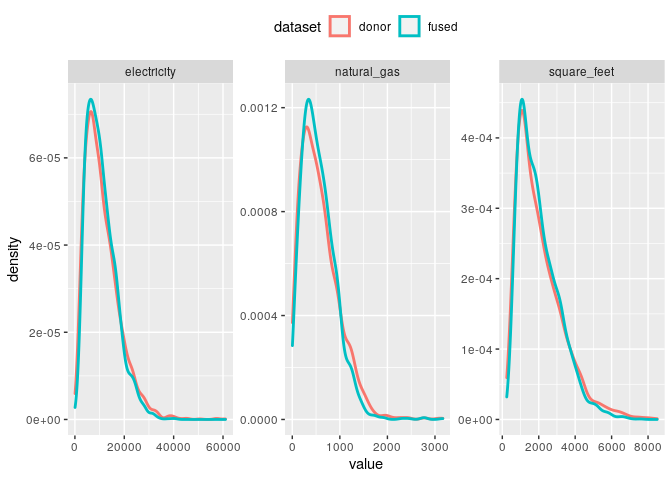

fusionModel
================
Kevin Ummel (<ummel@berkeley.edu>)

- <a href="#overview" id="toc-overview">Overview</a>
- <a href="#motivation" id="toc-motivation">Motivation</a>
- <a href="#methodology" id="toc-methodology">Methodology</a>
- <a href="#installation" id="toc-installation">Installation</a>
- <a href="#simple-fusion" id="toc-simple-fusion">Simple fusion</a>
- <a href="#advanced-fusion" id="toc-advanced-fusion">Advanced fusion</a>
- <a href="#analyzing-fused-data" id="toc-analyzing-fused-data">Analyzing
  fused data</a>
- <a href="#validating-fusion-models"
  id="toc-validating-fusion-models">Validating fusion models</a>

# Overview

**fusionModel** enables variables unique to a “donor” dataset to be
statistically simulated for (i.e. *fused to*) a “recipient” dataset.
Variables common to both the donor and recipient are used to model and
simulate the fused variables. The package provides a simple and
efficient interface for general data fusion in *R*, leveraging
state-of-the-art machine learning algorithms from Microsoft’s
[LightGBM](https://lightgbm.readthedocs.io/en/latest/) framework. It
also provides tools for analyzing synthetic/simulated data, calculating
uncertainty, and validating fusion output.

fusionModel was developed to allow statistical integration of microdata
from disparate social surveys. It is the data fusion workhorse
underpinning the larger fusionACS data platform under development at the
[Socio-Spatial Climate
Collaborative](https://sc2.berkeley.edu/fusionacs-people/). In this
context, fusionModel is used to fuse variables from a range of social
surveys onto microdata from the American Community Survey, allowing for
analysis and spatial resolution otherwise impossible.

# Motivation

The desire to “fuse” or otherwise integrate independent datasets has a
long history, dating to at least the early 1970’s ([Ruggles and Ruggles
1974](https://www.nber.org/system/files/chapters/c10115/c10115.pdf);
[Alter
1974](https://www.nber.org/system/files/chapters/c10116/c10116.pdf)).
Social scientists have long recognized that large amounts of unconnected
data are “out there” – usually concerning the characteristics of
households and individuals (i.e. microdata) – which we would, ideally,
like to integrate and analyze as a whole. This aim falls under the
general heading of “Statistical Data Integration” (SDI) ([Lewaa et
al. 2021](https://content.iospress.com/articles/statistical-journal-of-the-iaos/sji210835)).

The most prominent examples of data fusion have involved administrative
record linkage. This consists of exact matching or probabilistic linking
of independent datasets, using observable information like social
security numbers, names, or birth dates of individuals. Record linkage
is the gold standard and can yield incredibly important insights and
high levels of statistical confidence, as evidenced by the pioneering
work of [Raj Chetty](https://opportunityinsights.org/team/raj-chetty/)
and colleagues.

However, record linkage is rarely feasible for the kinds of microdata
that most researchers use day-to-day (nevermind the difficulty of
accessing administrative data). While the explosion of online tracking
and social network data will undoubtedly offer new lines of analysis,
for the time being, at least, social survey microdata remain
indispensable. The challenge and promise recognized 50 years ago by
Nancy and Richard Ruggles remains true today:

> Unfortunately, no single microdata set contains all of the different
> kinds of information required for the problems which the economist
> wishes to analyze. Different microdata sets contain different kinds of
> information…A great deal of information is collected on a sample
> basis. Where two samples are involved the probability of the same
> individual appearing in both may be very small, so that exact matching
> is impossible. Other methods of combining the types of information
> contained in the two different samples into one microdata set will be
> required. (Ruggles and Ruggles 1974; 353-354)

Practitioners regularly impute or otherwise predict a variable or two
from one dataset on to another. Piecemeal, *ad hoc* data fusion is a
common necessity of quantitative research. Proper data fusion, on the
other hand, seeks to systematically combine “two different samples into
one microdata set”.

The size and nature of the samples involved and the intended analyses
strongly influence the choice of data integration technique and the
structure of the output. This has led to the relevant literature being
both diverse and convoluted, as practitioners take on different data
“setups” and objectives. In the context of fusionACS, we are interested
in the following problem:

We have microdata from two independent surveys, A and B, that sample the
same underlying population and time period (e.g. occupied U.S.
households nationwide in 2018). We specify that A is the “recipient”
dataset and B is the “donor”. The goal is to generate a new dataset, C,
that has the original survey responses of A plus a realistic
representation of how each respondent in A might have answered the
questionnaire of survey B. To do this, we identify a set of
common/shared variables X that both surveys solicit. We then attempt to
fuse a set of variables unique to B – call them Z, the “fusion
variables” – onto the original microdata of A, conditional on X.

# Methodology

The fusion strategy implemented in the fusionModel package borrows and
expands upon ideas from the statistical matching ([D’Orazio et
al. 2006](https://onlinelibrary.wiley.com/doi/book/10.1002/0470023554)),
imputation ([Little and Rubin
2019](https://onlinelibrary.wiley.com/doi/book/10.1002/9781119482260)),
and data synthesis ([Drechsler
2011](https://link.springer.com/book/10.1007/978-1-4614-0326-5))
literatures to create a flexible data fusion tool. It employs
variable-*k*, conditional expectation matching that leverages
high-performance gradient boosting algorithms. The package accommodates
fusion of many variables, individually or in blocks, and efficient
computation when the recipient is large relative to the donor.

Specifically, the goal was to create a data fusion tool that meets the
following requirements:

1.  Accommodate donor and recipient datasets with divergent sample sizes
2.  Handle continuous, categorical, and semi-continuous (zero-inflated)
    variable types
3.  Ensure realistic values for fused variables
4.  Scale efficiently for larger datasets
5.  Fuse variables “one-by-one” or in “blocks”
6.  Employ a data modeling approach that:

- Makes no distributional assumptions (i.e. non-parametric)
- Automatically detects non-linear and interaction effects
- Automatically selects predictor variables from a potentially large set
- Ability to prevent overfitting (e.g. cross-validation)

Complete methodological details are available in the fusionACS Guidebook
(INSERT LINK).

# Installation

``` r
devtools::install_github("ummel/fusionModel")
```

``` r
library(fusionModel)
```

    fusionModel v2.2.1 | https://github.com/ummel/fusionModel

# Simple fusion

The package includes example microdata from the [2015 Residential Energy
Consumption
Survey](https://www.eia.gov/consumption/residential/data/2015/) (see
`?recs` for details). For real-world use cases, the donor and recipient
data are typically independent and vary in sample size. For illustrative
purposes, we will randomly split the `recs` microdata into separate
“donor” and “recipient” datasets with an equal number of observations.

``` r
# Rows to use for donor dataset
d <- seq(from = 1, to = nrow(recs), by = 2)

# Create donor and recipient datasets
donor <- recs[d, c(2:16, 20:22)]
recipient <- recs[-d, 2:14]

# Specify fusion and shared/common predictor variables
predictor.vars <- names(recipient)
fusion.vars <- setdiff(names(donor), predictor.vars)
```

The `recipient` dataset contains 13 variables that are shared with
`donor`. These shared “predictor” variables provide a statistical link
between the two datasets. fusionModel exploits the information in these
shared variables.

``` r
predictor.vars
```

     [1] "income"      "age"         "race"        "education"   "employment" 
     [6] "hh_size"     "division"    "urban_rural" "climate"     "renter"     
    [11] "home_type"   "year_built"  "heat_type"  

There are 5 “fusion variables” unique to `donor`. These are the
variables that will be fused to `recipient`. This includes a mix of
continuous and categorical (factor) variables.

``` r
# The variables to be fused
sapply(donor[fusion.vars], class)
```

    $insulation
    [1] "ordered" "factor" 

    $aircon
    [1] "factor"

    $square_feet
    [1] "integer"

    $electricity
    [1] "numeric"

    $natural_gas
    [1] "numeric"

We create a fusion model using the `train()` function. The minimal usage
is shown below. See `?train` for additional function arguments and
options. By default, this results in a “.fsn” (fusion) object being
saved to “fusion_model.fsn” in the current working directory.

``` r
# Train a fusion model
fsn.model <- train(data = donor, 
                   y = fusion.vars, 
                   x = predictor.vars)
```

    5 fusion variables
    13 initial predictor variables
    2843 observations
    Using all available predictors for each fusion variable
    Training step 1 of 5: insulation
    Training step 2 of 5: aircon
    Training step 3 of 5: square_feet
    -- R-squared of cluster means: 0.967 
    -- Number of neighbors in each cluster:
       Min. 1st Qu.  Median    Mean 3rd Qu.    Max. 
       10.0    49.0   141.0   200.6   357.0   498.0 
    Training step 4 of 5: electricity
    -- R-squared of cluster means: 0.966 
    -- Number of neighbors in each cluster:
       Min. 1st Qu.  Median    Mean 3rd Qu.    Max. 
      10.00   51.75  115.00  176.02  281.25  498.00 
    Training step 5 of 5: natural_gas
    -- R-squared of cluster means: 0.968 
    -- Number of neighbors in each cluster:
       Min. 1st Qu.  Median    Mean 3rd Qu.    Max. 
       10.0    54.0   129.0   170.1   247.0   499.0 
    Fusion model saved to: /home/kevin/Documents/Projects/fusionModel/fusion_model.fsn 
    Total processing time: 8.53 secs 

To fuse variables to `recipient`, we simply pass the recipient data and
path of the .fsn model to the `fuse()` function. Each variable specified
in `fusion.vars` is fused in the order provided. By default, `fuse()`
generates a single implicate (version) of synthetic outcomes. Later,
we’ll work with multiple implicates to perform proper analysis and
uncertainty estimation.

``` r
# Fuse 'fusion.vars' to the recipient
sim <- fuse(data = recipient, 
            fsn = fsn.model)
```

    5 fusion variables
    13 initial predictor variables
    2843 observations
    Generating 1 implicate 
    Fusion step 1 of 5: insulation
    -- Predicting LightGBM models
    -- Simulating fused values
    Fusion step 2 of 5: aircon
    -- Predicting LightGBM models
    -- Simulating fused values
    Fusion step 3 of 5: square_feet
    -- Predicting LightGBM models
    -- Simulating fused values
    Fusion step 4 of 5: electricity
    -- Predicting LightGBM models
    -- Simulating fused values
    Fusion step 5 of 5: natural_gas
    -- Predicting LightGBM models
    -- Simulating fused values
    Total processing time: 0.8 secs 

Let’s look at the the recipient dataset’s fused/simulated variables.
Note that your results will look different, because each call to
`fuse()` generates a unique, probabilistic set of outcomes.

``` r
head(sim)
```

       M           insulation                          aircon square_feet
    1: 1       Well insulated Central air conditioning system        1956
    2: 1       Well insulated Central air conditioning system        1621
    3: 1 Adequately insulated             No air conditioning         558
    4: 1 Adequately insulated Central air conditioning system        3072
    5: 1 Adequately insulated Central air conditioning system        1010
    6: 1 Adequately insulated             No air conditioning        1910
       electricity natural_gas
    1:       17000         0.0
    2:        6070       146.2
    3:        1334         0.0
    4:        9620       797.0
    5:       37500         0.0
    6:       11240       223.0

We can do some quick sanity checks to compare the distribution of the
fusion variables in `donor` with those in `sim`. This, at least,
confirms that the fusion output is not obviously wrong. Later, we’ll
perform a formal internal validation exercise using multiple implicates.

``` r
sim <- data.frame(sim)

# Compare means of the continuous variables
cbind(donor = colMeans(donor[fusion.vars[3:5]]), sim = colMeans(sim[fusion.vars[3:5]]))
```

                    donor        sim
    square_feet  2070.784  2012.7306
    electricity 10994.517 10675.6508
    natural_gas   338.154   323.5523

``` r
# Compare frequencies of categorical variable classes
cbind(donor = table(donor$insulation), sim = table(sim$insulation))
```

                         donor  sim
    Not insulated           40   40
    Poorly insulated       459  443
    Adequately insulated  1401 1419
    Well insulated         943  941

``` r
cbind(donor = table(donor$aircon), sim = table(sim$aircon))
```

                                               donor  sim
    Central air conditioning system             1788 1818
    Individual window/wall or portable units     545  545
    Both a central system and individual units   125  119
    No air conditioning                          385  361

And we can look at kernel density plots of the non-zero values for the
continuous variables to see if the univariate distributions in `donor`
are generally similar in `sim`.

<!-- -->

# Advanced fusion

For this call to `train()`, we specify a set of hyperparameters to
search over when training each LightGBM gradient boosting model (see
`?train` for details). The hyperparameters can be used to tune the
underlying GBM models for better cross-validated performance. We also
set `nfolds = 10` (default is 5) to indicate the number of
cross-validation folds to use. Since this requires additional
computation, the `cores` argument is used to enable parallel processing.

``` r
# Train a fusion model with variable blocks
fsn.model <- train(data = donor, 
                   y = fusion.vars, 
                   x = predictor.vars,
                   nfolds = 10,
                   hyper = list(boosting = c("gbdt", "goss"),
                                num_leaves = c(10, 30),
                                feature_fraction = c(0.7, 0.9)),
                   cores = 2)
```

    5 fusion variables
    13 initial predictor variables
    2843 observations
    Using all available predictors for each fusion variable
    Using OpenMP multithreading within LightGBM (2 cores)
    Training step 1 of 5: insulation
    Training step 2 of 5: aircon
    Training step 3 of 5: square_feet
    -- R-squared of cluster means: 0.971 
    -- Number of neighbors in each cluster:
       Min. 1st Qu.  Median    Mean 3rd Qu.    Max. 
       10.0    61.0   142.0   198.4   330.0   499.0 
    Training step 4 of 5: electricity
    -- R-squared of cluster means: 0.971 
    -- Number of neighbors in each cluster:
       Min. 1st Qu.  Median    Mean 3rd Qu.    Max. 
       10.0    61.0   179.0   220.7   388.0   499.0 
    Training step 5 of 5: natural_gas
    -- R-squared of cluster means: 0.959 
    -- Number of neighbors in each cluster:
       Min. 1st Qu.  Median    Mean 3rd Qu.    Max. 
       10.0    70.0   193.0   217.6   340.0   499.0 
    Fusion model saved to: /home/kevin/Documents/Projects/fusionModel/fusion_model.fsn 
    Total processing time: 44.9 secs 

We generally want to create multiple versions of the simulated fusion
variables – called *implicates* – in order to reduce bias in point
estimates and calculate associated uncertainty. We can do this using the
`M` argument within `fuse()`. Here we generate 10 implicates; i.e. 10
unique, probabilistic representations of what the recipient records
might look like with respect to the fusion variables.

``` r
# Fuse multiple implicates to the recipient
sim10 <- fuse(data = recipient, 
              fsn = fsn.model,
              M = 10)
```

    5 fusion variables
    13 initial predictor variables
    2843 observations
    Generating 10 implicates 
    Fusion step 1 of 5: insulation
    -- Predicting LightGBM models
    -- Simulating fused values
    Fusion step 2 of 5: aircon
    -- Predicting LightGBM models
    -- Simulating fused values
    Fusion step 3 of 5: square_feet
    -- Predicting LightGBM models
    -- Simulating fused values
    Fusion step 4 of 5: electricity
    -- Predicting LightGBM models
    -- Simulating fused values
    Fusion step 5 of 5: natural_gas
    -- Predicting LightGBM models
    -- Simulating fused values
    Total processing time: 2.38 secs 

Note that each implicate in `sim10` is identified by the “M”
variable/column.

``` r
head(sim10)
```

       M           insulation                                   aircon square_feet
    1: 1       Well insulated          Central air conditioning system        1728
    2: 1 Adequately insulated          Central air conditioning system        1492
    3: 1       Well insulated                      No air conditioning         636
    4: 1       Well insulated          Central air conditioning system        2948
    5: 1       Well insulated Individual window/wall or portable units        1140
    6: 1 Adequately insulated                      No air conditioning        1579
       electricity natural_gas
    1:       13700         0.0
    2:       15200         0.0
    3:        1880        89.7
    4:        8670       651.0
    5:       14460         0.0
    6:       14220         0.0

``` r
table(sim10$M)
```


       1    2    3    4    5    6    7    8    9   10 
    2843 2843 2843 2843 2843 2843 2843 2843 2843 2843 

# Analyzing fused data

The fused values are inherently probabilistic, reflecting uncertainty in
the underlying statistical models. Multiple implicates are needed to
calculate unbiased point estimates and associated uncertainty for any
particular analysis of the data. In general, more implicates is
preferable but requires more computation.

Since proper analysis of multiple implicates can be rather cumbersome –
both from a coding and mathematical standpoint – the `analyze()`
function provides a convenient way to calculate point estimates and
associated uncertainty for common analyses. Potential analyses currently
include variable means, proportions, sums, counts, and medians,
(optionally) calculated for population subgroups.

For example, to calculate the mean value of the “electricity” variable
across all observations in the recipient dataset, we do the following.

``` r
analyze(x = list(mean = "electricity"),
        implicates = sim10)
```

    Using 10 implicates
    Assuming uniform sample weights
    Total processing time: 0.0344 secs 

          N           y level type      est      moe
    1: 2843 electricity    NA mean 10808.86 232.2422

When the response variable is categorical, `analyze()` automatically
returns the proportions associated with each factor level.

``` r
analyze(x = list(mean = "aircon"),
        implicates = sim10)
```

    Using 10 implicates
    Assuming uniform sample weights
    Total processing time: 0.0903 secs 

          N      y                                      level       type        est
    1: 2843 aircon            Central air conditioning system proportion 0.62866690
    2: 2843 aircon   Individual window/wall or portable units proportion 0.19212100
    3: 2843 aircon Both a central system and individual units proportion 0.04400281
    4: 2843 aircon                        No air conditioning proportion 0.13520929
               moe
    1: 0.017603881
    2: 0.015537772
    3: 0.007524075
    4: 0.014413665

If we want to perform an analysis across subsets of the recipient
population – for example, calculate the mean value of “electricity” by
household “income” – we can use the `by` and `static` arguments. We see
that mean electricity consumption increases with household income.

``` r
analyze(x = list(mean = "electricity"),
        implicates = sim10,
        static = recipient,
        by = "income")
```

    Using 10 implicates
    Assuming uniform sample weights
    Total processing time: 0.0229 secs 

                     income   N           y level type       est       moe
    1:    Less than $20,000 471 electricity    NA mean  8884.312  478.0797
    2:    $20,000 - $39,999 645 electricity    NA mean  9719.018  456.4553
    3:    $40,000 - $59,999 464 electricity    NA mean 10537.228  538.0130
    4:   $60,000 to $79,999 372 electricity    NA mean 11314.790  572.3587
    5:   $80,000 to $99,999 248 electricity    NA mean 11550.401  693.7652
    6: $100,000 to $119,999 222 electricity    NA mean 12138.498  850.3994
    7: $120,000 to $139,999 119 electricity    NA mean 12490.518 1113.5339
    8:     $140,000 or more 302 electricity    NA mean 13683.182  728.6027

It is also possible to do multiple kinds of analyses in a single call to
`analyze()`. For example, the following call calculates the mean value
of “natural_gas” and “square_feet”, the median value of “square_feet”,
and the sum of “electricity” (i.e. total consumption) and “insulation”
(i.e. total count of each level). All of these estimates are calculated
for each population subgroup defined by the intersection of “race” and
“urban_rural” status.

``` r
result <- analyze(x = list(mean = c("natural_gas", "square_feet"),
                           median = "square_feet",
                           sum = c("electricity", "insulation")),
                  implicates = sim10,
                  static = recipient,
                  by = c("race", "urban_rural"))
```

    Using 10 implicates
    Assuming uniform sample weights
    Total processing time: 1.63 secs 

We can then (for example) isolate the results for white households in
rural areas. Notice that the mean estimate of “square_feet” exceeds the
median, reflecting the skewed distribution.

``` r
subset(result, race == "White" & urban_rural == "Rural")
```

        race urban_rural   N           y                level   type          est
    1: White       Rural 503 electricity                 <NA>    sum 6906696.6100
    2: White       Rural 503  insulation        Not insulated  count       5.6000
    3: White       Rural 503  insulation     Poorly insulated  count      68.4000
    4: White       Rural 503  insulation Adequately insulated  count     209.7000
    5: White       Rural 503  insulation       Well insulated  count     219.3000
    6: White       Rural 503 natural_gas                 <NA>   mean     157.5723
    7: White       Rural 503 square_feet                 <NA>   mean    2387.3509
    8: White       Rural 503 square_feet                 <NA> median    2159.4000
                moe
    1: 3.115890e+05
    2: 5.653837e+00
    3: 2.178315e+01
    4: 3.144372e+01
    5: 3.613723e+01
    6: 2.579220e+01
    7: 1.164896e+02
    8: 1.573095e+02

More complicated analyses can be performed using the custom `fun`
argument to `analyze()`. See the Examples section of `?analyze`.

# Validating fusion models

The `validate()` function provides a convenient way to perform internal
validation tests on synthetic variables that have been fused back onto
the original donor data. This allows us to assess the quality of the
underlying fusion model; it is analogous to assessing model skill by
comparing predictions to the observed training data.

`validate()` compares analytical results derived using the
multiple-implicate fusion output with those derived using the original
donor microdata. By performing analyses on population subsets of varying
size, `validate()` estimates how the synthetic variables perform for
analyses of varying difficulty/complexity. It computes fusion variable
means and proportions for subsets of the full sample – separately for
both the observed and fused data – and then compares the results.

First, we fuse multiple implicates of the `fusion.vars` using the
original donor data – *not* the `recipient` data, as we did previously.

``` r
sim <- fuse(data = donor,
            fsn = fsn.model,
            M = 40)
```

    5 fusion variables
    13 initial predictor variables
    2843 observations
    Generating 40 implicates 
    Fusion step 1 of 5: insulation
    -- Predicting LightGBM models
    -- Simulating fused values
    Fusion step 2 of 5: aircon
    -- Predicting LightGBM models
    -- Simulating fused values
    Fusion step 3 of 5: square_feet
    -- Predicting LightGBM models
    -- Simulating fused values
    Fusion step 4 of 5: electricity
    -- Predicting LightGBM models
    -- Simulating fused values
    Fusion step 5 of 5: natural_gas
    -- Predicting LightGBM models
    -- Simulating fused values
    Total processing time: 7.8 secs 

Next, we pass the `sim` results to `validate()`. The argument
`subset_vars` specifies that we want the validation exercise to compare
observed (donor) and simulated point estimates across population subsets
defined by “income”, “age”, “race”, and “education”. See `?validate` for
more details.

``` r
valid <- validate(observed = donor,
                  implicates = sim,
                  subset_vars = c("income", "age", "race", "education"))
```

    Assuming uniform sample weights
    One-hot encoding categorical fusion variables
    Correlation between observed and fused values:
       Min. 1st Qu.  Median    Mean 3rd Qu.    Max. 
      0.075   0.109   0.255   0.303   0.431   0.774 
    Processing validation analyses for 5 fusion variables
    Performed 1430 analyses across 130 subsets
    Smoothing validation metrics
    Average smoothed performance metrics across subset range:
                 y     est    vad   moe
    1       aircon  0.0323  0.689  1.37
    2  electricity  0.0225  0.419  1.06
    3   insulation  0.0390  0.492  1.41
    4  natural_gas  0.0277  0.500  1.06
    5  square_feet  0.0146  0.788  1.18
    Creating ggplot2 graphics  
    Total processing time: 3.14 secs 

The `validate()` output includes ggplot2 graphics that helpfully
summarize the validation results. For example, the plot below shows how
the observed and simulated point estimates compare, using median
absolute percent error as the performance metric. We see that the
synthetic data do a very good job reproducing the point estimates for
all fusion variables when the population subset in question is
reasonably large. For smaller subsets – i.e. more difficult analyses due
to small sample size – “square_feet”, “natural_gas”, and “electricity”
remain well modeled, but the error increases more rapidly for “aircon”
and “insulation”. This information is useful for understanding what kind
of reliability we can expect for particular variables and types of
analyses, given the underlying fusion model and data.

``` r
valid$plots$est
```

<!-- -->

Happy fusing!
